# .minimum-intelligence 🦞 An AI Agent As A Drop In

<p align="center">
  <picture>
    
  </picture>
</p>

### Get an AI agent running in any GitHub repo in under 5 minutes.

A personal AI assistant that runs entirely through GitHub Issues and Actions. Drop a single `.minimum-intelligence` folder into any repo and you have a fully functional AI agent — no servers, no external services, no extra infrastructure.

Powered by the [pi coding agent](https://github.com/badlogic/pi-mono). Every issue becomes a chat thread with an AI agent. Conversation history is committed to git, giving the agent long-term memory across sessions. It can search prior context, edit or summarize past conversations, and all changes are versioned.

Since the agent can read and write files, you can build an evolving software project that updates itself as you open issues. Try asking it to set up a GitHub Pages site, then iterate on it issue by issue.

---

## How It Works

The entire system runs as a closed loop inside your GitHub repository. When you open an issue (or comment on one), a GitHub Actions workflow launches the AI agent, which reads your message, thinks, responds, and commits its work — all without leaving GitHub.

```mermaid
flowchart TD
    A["👤 User opens or comments\non a GitHub Issue"] --> B["⚡ GitHub Actions\ntriggers workflow"]
    B --> C{"🔐 Authorize\ncollaborator?"}
    C -- No --> D["🚫 Rejected"]
    C -- Yes --> E["👀 Add reaction\nindicator"]
    E --> F["📦 Install\ndependencies"]
    F --> G{"🔄 Existing session\nfor this issue?"}
    G -- Yes --> H["📂 Load prior\nsession context"]
    G -- No --> I["🆕 Create fresh\nsession"]
    H --> J["🤖 Run pi AI agent\nwith prompt + context"]
    I --> J
    J --> K["💾 Persist session\n& issue mapping"]
    K --> L["📤 Commit & push\nstate to repo"]
    L --> M["💬 Post reply as\nissue comment"]
    M --> N["✅ Remove 👀\nreaction"]

    style A fill:#4CAF50,color:#fff
    style J fill:#2196F3,color:#fff
    style M fill:#FF9800,color:#fff
    style D fill:#f44336,color:#fff
    style N fill:#9C27B0,color:#fff
```



### Key concepts

| Concept | Description |
|---|---|
| **Issue = Conversation** | Each GitHub issue maps to a persistent AI conversation. Comment again to continue where you left off. |
| **Git = Memory** | Session transcripts are committed to the repo. The agent has full recall of every prior exchange. |
| **Actions = Runtime** | GitHub Actions is the only compute layer. No servers, no containers, no external services. |
| **Repo = Storage** | All state — sessions, mappings, and agent edits — lives in the repository itself. |

### State management

All state lives in the repo:

```
.minimum-intelligence/state/
  issues/
    1.json          # maps issue #1 → its session file
  sessions/
    2026-02-04T..._abc123.jsonl    # full conversation for issue #1
```

Each issue number is a stable conversation key — `issue #N` → `state/issues/N.json` → `state/sessions/<session>.jsonl`. When you comment on an issue weeks later, the agent loads that linked session and continues. No database, no session cookies — just git.

---

## Prerequisites

- A GitHub repository (new or existing)
- [Bun](https://bun.sh) installed locally
- An API key from your chosen LLM provider (see [Supported providers](#supported-providers) below)

## Setup

**1. Add minimum-intelligence to your repo**

Copy the `.minimum-intelligence` folder into your repository root, then run the install script:

```bash
bun .minimum-intelligence/install/MINIMUM-INTELLIGENCE-INSTALLER.ts
```

This sets up the GitHub Actions workflow and issue templates.

**2. Install dependencies**

```bash
cd .minimum-intelligence && bun install
```

**3. Add your API key**

In your GitHub repo, go to **Settings → Secrets and variables → Actions** and create a secret for your chosen provider:

| Provider | Secret name | Where to get it |
|----------|------------|-----------------|
| Anthropic | `ANTHROPIC_API_KEY` | [console.anthropic.com](https://console.anthropic.com/) |
| OpenAI | `OPENAI_API_KEY` | [platform.openai.com](https://platform.openai.com/) |
| Google Gemini | `GEMINI_API_KEY` | [aistudio.google.com](https://aistudio.google.com/) |
| xAI (Grok) | `XAI_API_KEY` | [console.x.ai](https://console.x.ai/) |
| DeepSeek (via OpenRouter) | `OPENROUTER_API_KEY` | [openrouter.ai](https://openrouter.ai/) |
| Mistral | `MISTRAL_API_KEY` | [console.mistral.ai](https://console.mistral.ai/) |
| Groq | `GROQ_API_KEY` | [console.groq.com](https://console.groq.com/) |

Then reference the secret in your workflow (`.github/workflows/MINIMUM-INTELLIGENCE-WORKFLOW-AGENT.yml`) as an environment variable in the **Run** step.

**4. Commit and push**

```bash
git add -A
git commit -m "Add minimum-intelligence"
git push
```

**5. Open an issue**

Go to your repo's **Issues** tab and create a new issue. Write anything — ask a question, request a file, start a conversation. The agent picks it up automatically.

That's it. The agent replies as a comment on the issue.

## What happens when you open an issue

```
You open an issue
    → GitHub Actions triggers the agent workflow
    → The agent reads your issue, thinks, and responds
    → Its reply appears as a comment (👀 shows while it's working)
    → The conversation is saved to git for future context
```

Comment on the same issue to continue the conversation. The agent picks up where it left off.

## Hatching — give the agent a personality

Use the **🥚 Hatch** issue template (or create an issue with the `hatch` label) to go through a guided conversation where you and the agent figure out its name, personality, and vibe together.

This is optional. The agent works without hatching, but it's more fun with a personality.

## What's in the `.minimum-intelligence` folder

| Path | Purpose |
|------|---------|
| `AGENTS.md` | Agent identity — name, personality, instructions |
| `lifecycle/MINIMUM-INTELLIGENCE-AGENT.ts` | Core orchestrator that runs on every issue |
| `.pi/settings.json` | LLM provider, model, and thinking level |
| `.pi/APPEND_SYSTEM.md` | System prompt loaded every session |
| `.pi/skills/` | Modular skill packages |
| `state/` | Session history and issue mappings |

## Common tweaks

**Change the model** — edit `.minimum-intelligence/.pi/settings.json`:

<details>
<summary><strong>Anthropic (default)</strong></summary>

```json
{
  "defaultProvider": "anthropic",
  "defaultModel": "claude-sonnet-4-20250514",
  "defaultThinkingLevel": "low"
}
```

Requires `ANTHROPIC_API_KEY`.
</details>

<details>
<summary><strong>OpenAI — GPT-5.3 Codex Spark</strong></summary>

```json
{
  "defaultProvider": "openai",
  "defaultModel": "gpt-5.3-codex-spark",
  "defaultThinkingLevel": "medium"
}
```

Requires `OPENAI_API_KEY`.
</details>

<details>
<summary><strong>OpenAI — GPT-5.3 Codex</strong></summary>

```json
{
  "defaultProvider": "openai",
  "defaultModel": "gpt-5.3-codex",
  "defaultThinkingLevel": "medium"
}
```

Requires `OPENAI_API_KEY`. Full-featured coding model with 400k context window.
</details>

<details>
<summary><strong>DeepSeek (via OpenRouter)</strong></summary>

```json
{
  "defaultProvider": "openrouter",
  "defaultModel": "deepseek/deepseek-r1",
  "defaultThinkingLevel": "medium"
}
```

Requires `OPENROUTER_API_KEY`.
</details>

<details>
<summary><strong>xAI — Grok</strong></summary>

```json
{
  "defaultProvider": "xai",
  "defaultModel": "grok-3",
  "defaultThinkingLevel": "medium"
}
```

Requires `XAI_API_KEY`.
</details>

<details>
<summary><strong>Google Gemini — gemini-2.5-pro</strong></summary>

```json
{
  "defaultProvider": "google",
  "defaultModel": "gemini-2.5-pro",
  "defaultThinkingLevel": "medium"
}
```

Requires `GEMINI_API_KEY`.
</details>

<details>
<summary><strong>Google Gemini — gemini-2.5-flash</strong></summary>

```json
{
  "defaultProvider": "google",
  "defaultModel": "gemini-2.5-flash",
  "defaultThinkingLevel": "medium"
}
```

Requires `GEMINI_API_KEY`. Faster and cheaper than gemini-2.5-pro.
</details>

<details>
<summary><strong>xAI — Grok Mini</strong></summary>

```json
{
  "defaultProvider": "xai",
  "defaultModel": "grok-3-mini",
  "defaultThinkingLevel": "medium"
}
```

Requires `XAI_API_KEY`. Lighter version of Grok 3.
</details>

<details>
<summary><strong>DeepSeek Chat (via OpenRouter)</strong></summary>

```json
{
  "defaultProvider": "openrouter",
  "defaultModel": "deepseek/deepseek-chat",
  "defaultThinkingLevel": "medium"
}
```

Requires `OPENROUTER_API_KEY`.
</details>

<details>
<summary><strong>Mistral</strong></summary>

```json
{
  "defaultProvider": "mistral",
  "defaultModel": "mistral-large-latest",
  "defaultThinkingLevel": "medium"
}
```

Requires `MISTRAL_API_KEY`.
</details>

<details>
<summary><strong>Groq</strong></summary>

```json
{
  "defaultProvider": "groq",
  "defaultModel": "deepseek-r1-distill-llama-70b",
  "defaultThinkingLevel": "medium"
}
```

Requires `GROQ_API_KEY`.
</details>

<details>
<summary><strong>OpenRouter (any model)</strong></summary>

```json
{
  "defaultProvider": "openrouter",
  "defaultModel": "your-chosen-model",
  "defaultThinkingLevel": "medium"
}
```

Requires `OPENROUTER_API_KEY`. Browse available models at [openrouter.ai](https://openrouter.ai/).
</details>

**Make it read-only** — add `--tools read,grep,find,ls` to the agent args in `lifecycle/MINIMUM-INTELLIGENCE-AGENT.ts`.

**Filter by label** — edit `.github/workflows/MINIMUM-INTELLIGENCE-WORKFLOW-AGENT.yml` to only trigger on issues with a specific label.

## Supported providers

`.pi` supports a wide range of LLM providers out of the box. Set `defaultProvider` and `defaultModel` in `.minimum-intelligence/.pi/settings.json` and add the matching API key to your workflow:

| Provider | `defaultProvider` | Example model | API key env var |
|----------|-------------------|---------------|-----------------|
| Anthropic | `anthropic` | `claude-sonnet-4-20250514` | `ANTHROPIC_API_KEY` |
| OpenAI | `openai` | `gpt-5.3-codex`, `gpt-5.3-codex-spark` | `OPENAI_API_KEY` |
| Google Gemini | `google` | `gemini-2.5-pro`, `gemini-2.5-flash` | `GEMINI_API_KEY` |
| xAI (Grok) | `xai` | `grok-3`, `grok-3-mini` | `XAI_API_KEY` |
| DeepSeek | `openrouter` | `deepseek/deepseek-r1`, `deepseek/deepseek-chat` | `OPENROUTER_API_KEY` |
| Mistral | `mistral` | `mistral-large-latest` | `MISTRAL_API_KEY` |
| Groq | `groq` | `deepseek-r1-distill-llama-70b` | `GROQ_API_KEY` |
| OpenRouter | `openrouter` | any model on [openrouter.ai](https://openrouter.ai/) | `OPENROUTER_API_KEY` |

> **Tip:** The `pi` agent supports many more providers and models. Run `pi --help` or see the [pi-mono docs](https://github.com/badlogic/pi-mono) for the full list.

## Security

The workflow only responds to repository **owners, members, and collaborators**. Random users cannot trigger the agent on public repos.

If you plan to use minimum-intelligence for anything private, **make the repo private**. Public repos mean your conversation history is visible to everyone, but get generous GitHub Actions usage.

## Next steps

- Explore the [onboarding docs](.minimum-intelligence/README.md) for deep dives into architecture, capabilities, skills, and personality

## Acknowledgments

Built on top of [pi-mono](https://github.com/badlogic/pi-mono) by [Mario Zechner](https://github.com/badlogic).
