<p align="center">
  <picture>
    
  </picture>
</p>

<h1 align="center">GitHub Minimum Intelligence</h1>

<p align="center">
  <strong>An AI agent that lives in your GitHub Repo<br/>Just Issues and Actions and your Repo</strong>
</p>

<p align="center">
  <a href="#quick-start">Quick Start</a> · <a href="#how-it-works">How It Works</a> · <a href="#installation-methods">Install</a> · <a href="#supported-providers">Providers</a> · <a href="#configuration">Config</a>
</p>

---

Drop a single `.github-minimum-intelligence` folder into any repo and you have a fully functional AI agent. Every GitHub issue becomes a conversation thread. The agent reads your message, thinks, responds, and commits its work - all inside your repository.

Powered by [pi mono](https://github.com/badlogic/pi-mono) conversation history is committed to git, giving your agent long-term memory across sessions. It can search prior context, edit or summarize past conversations, and all changes are versioned.

> **Quick-start**: An `ANTHROPIC_API_KEY` secret is all you need - but any [supported LLM provider](#supported-providers) works.

---

## Your Data, Your Environment

With a typical LLM, every question you ask and every answer you receive lives on _someone else's_ platform. You copy code out of a chat window, paste it into your editor, and hope you grabbed the right version. The knowledge you build up is trapped in a third-party service - scattered across browser tabs and chat logs you'll never find again.

**Minimum Intelligence flips that model.** Every prompt you write and every response the agent produces is committed directly to your repository as part of its normal workflow. There is nothing to copy, nothing to paste, and nothing stored outside your control.

- **Ask a question** → the answer is already in your repo.
- **Request a file change** → the agent commits the edit for you.
- **Continue a conversation weeks later** → the full history is right there in git.

Your repository _is_ the AI workspace. The questions, the results, the code, the context - it all lives where your work already lives, versioned and searchable, owned entirely by you.

---

## Quick Start

Get an AI agent running in any GitHub repo in under 5 minutes:

```bash
# From the root of any git repository
curl -fsSL https://raw.githubusercontent.com/japer-technology/github-minimum-intelligence/main/setup.sh | bash
```

Then:

1. Add your LLM API key as a repository secret ([details below](#add-your-api-key)).
2. `git add -A && git commit -m "Add minimum-intelligence" && git push`
3. Open an issue - the agent replies automatically.

---

## Why Minimum Intelligence

| Capability | Why it matters |
|---|---|
| **Single folder, any repo** | Copy `.github-minimum-intelligence/` in and run the install script. Nothing to host or maintain. |
| **Zero infrastructure** | Runs on GitHub Actions with your repo as the only backend. |
| **Persistent memory** | Conversations are committed to git - the agent remembers everything across sessions. |
| **Full auditability** | Every interaction is versioned; review or roll back any change the agent made. |
| **Multi-provider LLM support** | Works with Anthropic, OpenAI, Google Gemini, xAI, DeepSeek, Mistral, Groq, and any OpenRouter model. |
| **Modular skill system** | Agent capabilities are self-contained Markdown files - user-extensible and composable. |
| **Personality hatching** | Give the agent a name, personality, and vibe through a guided conversation. |

---

## How It Works

The entire system runs as a closed loop inside your GitHub repository. When you open an issue (or comment on one), a GitHub Actions workflow launches the AI agent, which reads your message, thinks, responds, and commits its work - all without leaving GitHub.

```mermaid
flowchart TD
    A["Start<br/>User opens or comments<br/>on a GitHub Issue"] --> B["GitHub Actions<br/>triggers workflow"]
    B --> C{"Authorize<br/>collaborator?"}
    C -- No --> D["👎 Rejected"]
    C -- Yes --> E["🚀 Add reaction<br/>indicator"]
    E --> F["Install<br/>dependencies"]
    F --> G{"Existing session<br/>for this issue?"}
    G -- Yes --> H["Load prior<br/>session context"]
    G -- No --> I["Create fresh<br/>session"]
    H --> J["Run pi AI agent<br/>with prompt + context"]
    I --> J
    J --> K["Persist session<br/>& issue mapping"]
    K --> L["Commit & push<br/>state to repo"]
    L --> M["Post reply as<br/>issue comment"]
    M --> N["End<br/>User sees the results"]

    style A fill:#4CAF50,color:#fff
    style J fill:#2196F3,color:#fff
    style M fill:#FF9800,color:#fff
    style D fill:#f44336,color:#fff
    style N fill:#9C27B0,color:#fff
```



### Key Concepts

| Concept | Description |
|---|---|
| **Issue = Conversation** | Each GitHub issue maps to a persistent AI conversation. Comment again to continue where you left off. |
| **Git = Memory** | Session transcripts are committed to the repo. The agent has full recall of every prior exchange. |
| **Actions = Runtime** | GitHub Actions is the only compute layer. No servers, no containers, no external services. |
| **Repo = Storage** | All state - sessions, mappings, and agent edits - lives in the repository itself. |

### State Management

All state lives in the repo:

```
.github-minimum-intelligence/state/
  issues/
    1.json          # maps issue #1 → its session file
  sessions/
    2026-02-04T..._abc123.jsonl    # full conversation for issue #1
```

Each issue number is a stable conversation key - `issue #N` → `state/issues/N.json` → `state/sessions/<session>.jsonl`. When you comment on an issue weeks later, the agent loads that linked session and continues. No database, no session cookies - just git.

---

## Prerequisites

- A GitHub repository (new or existing)
- [Bun](https://bun.sh) installed locally (for manual setup methods)
- An API key from your chosen LLM provider (see [Supported providers](#supported-providers) below)

---

## Installation Methods

There are three ways to add Minimum Intelligence to a repository. Pick whichever fits your workflow.

| Method | Best for | GitHub App identity? |
|--------|----------|---------------------|
| [**Quick setup script**](#method-1-quick-setup-script) | Fastest - one command from your terminal | No (uses `GITHUB_TOKEN`) |
| [**Manual copy**](#method-2-manual-copy) | Full control, offline-friendly | No (uses `GITHUB_TOKEN`) |
| [**GitHub App**](#method-3-github-app) | Multi-repo, bot identity, centralised permissions | Yes |

---

### Method 1: Quick Setup Script

Run a single command from the **root of any git repository**:

```bash
curl -fsSL https://raw.githubusercontent.com/japer-technology/github-minimum-intelligence/main/setup.sh | bash
```

This downloads the `.github-minimum-intelligence/` folder, copies the workflow and issue templates into `.github/`, and installs dependencies.

After it finishes:

1. Add your LLM API key as a repository secret (see [step 3 below](#add-your-api-key)).
2. `git add -A && git commit -m "Add minimum-intelligence" && git push`
3. Open an issue - the agent replies automatically.

<details>
<summary>Prefer to download manually?</summary>

Download the [latest zip](https://github.com/japer-technology/github-minimum-intelligence/archive/refs/heads/main.zip), extract it, copy the `.github-minimum-intelligence/` folder into your repo root, then run:

```bash
bun .github-minimum-intelligence/install/MINIMUM-INTELLIGENCE-INSTALLER.ts
```

</details>

---

### Method 2: Manual Copy

If you want full control over every file:

**1. Add minimum-intelligence to your repo**

Copy the `.github-minimum-intelligence` folder into your repository root, then run the install script:

```bash
bun .github-minimum-intelligence/install/MINIMUM-INTELLIGENCE-INSTALLER.ts
```

This sets up the GitHub Actions workflow and issue templates.

**2. Install dependencies**

```bash
cd .github-minimum-intelligence && bun install
```

**3. Add your API key** {#add-your-api-key}

In your GitHub repo, go to **Settings → Secrets and variables → Actions** and create a secret for your chosen provider:

| Provider | Secret name | Where to get it |
|----------|------------|-----------------|
| Anthropic | `ANTHROPIC_API_KEY` | [console.anthropic.com](https://console.anthropic.com/) |
| OpenAI | `OPENAI_API_KEY` | [platform.openai.com](https://platform.openai.com/) |
| Google Gemini | `GEMINI_API_KEY` | [aistudio.google.com](https://aistudio.google.com/) |
| xAI (Grok) | `XAI_API_KEY` | [console.x.ai](https://console.x.ai/) |
| DeepSeek (via OpenRouter) | `OPENROUTER_API_KEY` | [openrouter.ai](https://openrouter.ai/) |
| Mistral | `MISTRAL_API_KEY` | [console.mistral.ai](https://console.mistral.ai/) |
| Groq | `GROQ_API_KEY` | [console.groq.com](https://console.groq.com/) |

**4. Commit and push**

```bash
git add -A
git commit -m "Add minimum-intelligence"
git push
```

**5. Open an issue**

Go to your repo's **Issues** tab and create a new issue. Write anything - ask a question, request a file, start a conversation. The agent picks it up automatically.

That's it. The agent replies as a comment on the issue.

---

### Method 3: GitHub App

Running minimum-intelligence as a **GitHub App** gives it its own bot identity, consistent permissions across repositories, and a path toward multi-repo installation without copy-pasting files.

<details>
<summary><strong>How the GitHub App manifest flow works</strong></summary>

The included [`app-manifest.json`](./app-manifest.json) is a declarative description of the App's name, permissions, and events. GitHub's **manifest flow** lets you register an App by submitting this JSON instead of filling out every form field by hand. After registration GitHub gives you credentials (App ID + private key) that your workflow uses to authenticate.

```
┌─────────────────────────────────────────────────────────────┐
│ 1. You submit app-manifest.json to GitHub                   │
│    (via the UI or API)                                      │
│                                                             │
│ 2. GitHub creates the App and returns:                      │
│    • App ID (numeric)                                       │
│    • Private key (.pem file)                                │
│    • Webhook secret                                         │
│                                                             │
│ 3. You store APP_ID + APP_PRIVATE_KEY as repo secrets       │
│                                                             │
│ 4. You install the App on target repos                      │
│    (Settings → Developer settings → GitHub Apps → Install)  │
│                                                             │
│ 5. When an issue is opened, the workflow uses the App       │
│    credentials to generate a short-lived token and run      │
│    the agent under the App's bot identity                   │
└─────────────────────────────────────────────────────────────┘
```

</details>

#### 1. Register the GitHub App

Use the included [`app-manifest.json`](./app-manifest.json) to register the app automatically via GitHub's manifest flow:

1. Go to **GitHub → Settings → Developer settings → GitHub Apps → New GitHub App**.
2. Scroll to the bottom and click **"Register a GitHub App from a manifest"**.
3. Paste the contents of `app-manifest.json` and submit.

Or use the [GitHub Apps API](https://docs.github.com/en/apps/creating-github-apps/registering-a-github-app/registering-a-github-app-from-a-manifest) to register programmatically:

```bash
# POST the manifest to register the app (opens a browser for confirmation)
curl -X POST https://github.com/settings/apps/new \
  -H "Accept: application/json" \
  -d @app-manifest.json
```

After registration you will receive:
- An **App ID** (numeric)
- A **private key** (`.pem` file to download)

#### 2. Store the App credentials as secrets

In the repository where the agent workflow lives, go to **Settings → Secrets and variables → Actions** and add:

| Secret name | Value |
|-------------|-------|
| `APP_ID` | The numeric App ID shown on the app's settings page |
| `APP_PRIVATE_KEY` | The full contents of the downloaded `.pem` private key file |

#### 3. Install the App on target repositories

Go to the app's **Install** page (linked from its settings) and install it on the repositories where you want the agent to respond to issues. The app needs **read/write** access to **Issues**, **Contents**, and **Actions**.

When the App is installed on a new repository, the `github-minimum-intelligence-installation` workflow automatically creates a welcome issue with setup instructions.

#### 4. Add your LLM API key

In each target repo, go to **Settings → Secrets and variables → Actions** and add the key for your chosen LLM provider (see the table in the [manual copy section](#add-your-api-key) above).

#### Quick start after installing the GitHub App

After installing the App on a repo that already has the `.github-minimum-intelligence/` folder, just open an issue - the agent is ready. If the repo does not have the folder yet, run the [quick setup script](#method-1-quick-setup-script) first.

---

## What Happens When You Open an Issue

```
You open an issue
    → GitHub Actions triggers the agent workflow
    → The agent reads your issue, thinks, and responds
    → Its reply appears as a comment (🚀 shows while it's working, 👍 on success)
    → The conversation is saved to git for future context
```

Comment on the same issue to continue the conversation. The agent picks up where it left off.

---

## Hatching - Give the Agent a Personality

Use the **🥚 Hatch** issue template (or create an issue with the `hatch` label) to go through a guided conversation where you and the agent figure out its name, personality, and vibe together.

This is optional. The agent works without hatching, but it's more fun with a personality.

---

## Project Structure

```
.github-minimum-intelligence/
  .pi/                              # Agent personality & skills config
    settings.json                   # LLM provider, model, and thinking level
    APPEND_SYSTEM.md                # System prompt loaded every session
    BOOTSTRAP.md                    # First-run identity prompt
    skills/                         # Modular skill packages
  install/
    MINIMUM-INTELLIGENCE-INSTALLER.ts            # Setup script - installs workflows & templates
    github-minimum-intelligence-agent.yml         # GitHub Actions workflow template
    github-minimum-intelligence-hatch.md          # Issue template for personality hatching
    MINIMUM-INTELLIGENCE-AGENTS.md               # Default agent identity file
    package.json                    # Installer dependencies
  lifecycle/
    agent.ts                # Core agent orchestrator
    indicator.ts            # Adds 🚀 reaction on issue activity
  state/                            # Session history and issue mappings (git-tracked)
  AGENTS.md                         # Agent identity file
  package.json                      # Runtime dependencies
```

Additionally, [`setup.sh`](./setup.sh) at the repo root provides a one-command installer for adding minimum-intelligence to any repository (see [Quick Setup Script](#method-1-quick-setup-script)).

---

## Configuration

**Change the model** - edit `.github-minimum-intelligence/.pi/settings.json`:

<details>
<summary><strong>Anthropic (default)</strong></summary>

```json
{
  "defaultProvider": "anthropic",
  "defaultModel": "claude-sonnet-4-20250514",
  "defaultThinkingLevel": "low"
}
```

Requires `ANTHROPIC_API_KEY`.
</details>

<details>
<summary><strong>OpenAI - GPT-5.3 Codex Spark</strong></summary>

```json
{
  "defaultProvider": "openai",
  "defaultModel": "gpt-5.3-codex-spark",
  "defaultThinkingLevel": "medium"
}
```

Requires `OPENAI_API_KEY`.
</details>

<details>
<summary><strong>OpenAI - GPT-5.3 Codex</strong></summary>

```json
{
  "defaultProvider": "openai",
  "defaultModel": "gpt-5.3-codex",
  "defaultThinkingLevel": "medium"
}
```

Requires `OPENAI_API_KEY`. Full-featured coding model with 400k context window.
</details>

<details>
<summary><strong>DeepSeek (via OpenRouter)</strong></summary>

```json
{
  "defaultProvider": "openrouter",
  "defaultModel": "deepseek/deepseek-r1",
  "defaultThinkingLevel": "medium"
}
```

Requires `OPENROUTER_API_KEY`.
</details>

<details>
<summary><strong>xAI - Grok</strong></summary>

```json
{
  "defaultProvider": "xai",
  "defaultModel": "grok-3",
  "defaultThinkingLevel": "medium"
}
```

Requires `XAI_API_KEY`.
</details>

<details>
<summary><strong>Google Gemini - gemini-2.5-pro</strong></summary>

```json
{
  "defaultProvider": "google",
  "defaultModel": "gemini-2.5-pro",
  "defaultThinkingLevel": "medium"
}
```

Requires `GEMINI_API_KEY`.
</details>

<details>
<summary><strong>Google Gemini - gemini-2.5-flash</strong></summary>

```json
{
  "defaultProvider": "google",
  "defaultModel": "gemini-2.5-flash",
  "defaultThinkingLevel": "medium"
}
```

Requires `GEMINI_API_KEY`. Faster and cheaper than gemini-2.5-pro.
</details>

<details>
<summary><strong>xAI - Grok Mini</strong></summary>

```json
{
  "defaultProvider": "xai",
  "defaultModel": "grok-3-mini",
  "defaultThinkingLevel": "medium"
}
```

Requires `XAI_API_KEY`. Lighter version of Grok 3.
</details>

<details>
<summary><strong>DeepSeek Chat (via OpenRouter)</strong></summary>

```json
{
  "defaultProvider": "openrouter",
  "defaultModel": "deepseek/deepseek-chat",
  "defaultThinkingLevel": "medium"
}
```

Requires `OPENROUTER_API_KEY`.
</details>

<details>
<summary><strong>Mistral</strong></summary>

```json
{
  "defaultProvider": "mistral",
  "defaultModel": "mistral-large-latest",
  "defaultThinkingLevel": "medium"
}
```

Requires `MISTRAL_API_KEY`.
</details>

<details>
<summary><strong>Groq</strong></summary>

```json
{
  "defaultProvider": "groq",
  "defaultModel": "deepseek-r1-distill-llama-70b",
  "defaultThinkingLevel": "medium"
}
```

Requires `GROQ_API_KEY`.
</details>

<details>
<summary><strong>OpenRouter (any model)</strong></summary>

```json
{
  "defaultProvider": "openrouter",
  "defaultModel": "your-chosen-model",
  "defaultThinkingLevel": "medium"
}
```

Requires `OPENROUTER_API_KEY`. Browse available models at [openrouter.ai](https://openrouter.ai/).
</details>

**Make it read-only** - add `--tools read,grep,find,ls` to the agent args in `lifecycle/agent.ts`.

**Filter by label** - edit `.github/workflows/github-minimum-intelligence-agent.yml` to only trigger on issues with a specific label.

**Adjust thinking level** - set `defaultThinkingLevel` to `"low"`, `"medium"`, or `"high"` in `settings.json` for different task complexities.

---

## Supported Providers

`.pi` supports a wide range of LLM providers out of the box. Set `defaultProvider` and `defaultModel` in `.github-minimum-intelligence/.pi/settings.json` and add the matching API key to your workflow:

| Provider | `defaultProvider` | Example model | API key env var |
|----------|-------------------|---------------|-----------------|
| Anthropic | `anthropic` | `claude-sonnet-4-20250514` | `ANTHROPIC_API_KEY` |
| OpenAI | `openai` | `gpt-5.3-codex`, `gpt-5.3-codex-spark` | `OPENAI_API_KEY` |
| Google Gemini | `google` | `gemini-2.5-pro`, `gemini-2.5-flash` | `GEMINI_API_KEY` |
| xAI (Grok) | `xai` | `grok-3`, `grok-3-mini` | `XAI_API_KEY` |
| DeepSeek | `openrouter` | `deepseek/deepseek-r1`, `deepseek/deepseek-chat` | `OPENROUTER_API_KEY` |
| Mistral | `mistral` | `mistral-large-latest` | `MISTRAL_API_KEY` |
| Groq | `groq` | `deepseek-r1-distill-llama-70b` | `GROQ_API_KEY` |
| OpenRouter | `openrouter` | any model on [openrouter.ai](https://openrouter.ai/) | `OPENROUTER_API_KEY` |

> **Tip:** The `pi` agent supports many more providers and models. Run `pi --help` or see the [pi-mono docs](https://github.com/badlogic/pi-mono) for the full list.

---

## Security

The workflow only responds to repository **owners, members, and collaborators**. Random users cannot trigger the agent on public repos.

If you plan to use minimum-intelligence for anything private, **make the repo private**. Public repos mean your conversation history is visible to everyone, but get generous GitHub Actions usage.

---

## Repo Size

The repo is overwhelmingly dominated by node_modules (~99%). The actual project files (README, LICENSE, config, GitHub workflows, GMI state/lifecycle) are only about ~1 MB.

---

<p align="center">
  <picture>
    
  </picture>
</p>
